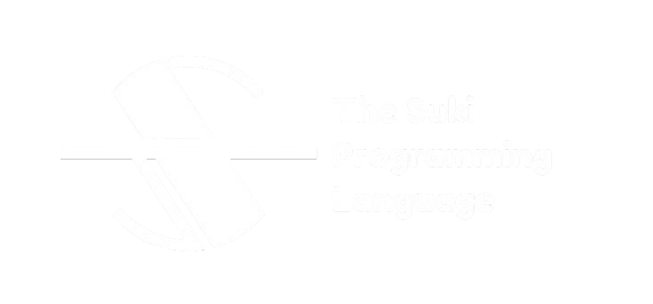

This is the main source code repository for Suki programming language. It contains the compiler, and documentation.

## Why Suki?

Suki is a simple programming language based on the [Verification for Security](https://verification-for-security.github.io/) course @VU Amsterdam. It supports affine types to ensure type safety and uses LLVM as the backend for code generation. Suki means 'liked' in Japanese, reflecting my appreciation for the practical design of the programming language.

## Quick Start

## Installing from Source
